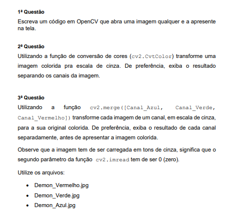

# 🖼️ Trabalho de Processamento digital de imagens 
Esse repositorio tem por objetivo mostrar as funções basicas de manipulação de imagens com openCV. Esse repositorio começou com o trabalho proposto pelo professor da matéria "Processamento Digital de imagens" da minha faculdade(UERJ-ZO). Esse trabalho consiste de 3 questões formuladas pelo professor que tem por objetivo manipular imagens com o python. As questões estão na imagens a seguir. 



## 🛠️ Dependencias do projeto
Todas as dependencias do projeto estão no arquivo `requirements.txt`.

Caso você deseje instalar as bibliotecas individualmente siga as instruções a seguir

- Começe instalando o python(Eu usei a versão 3.10)

Comando de instalação no Linux:
``` 
    apt-get install python3
```

- Após instalar o python instale as bibliotecas com o pip

openCV:
```
    pip install cv2
```

MatPlotLib:
```
    pip install matplotlib
```

> Caso tenha erro ao abrir a imagem com o matplotlib instale também `pip install PyQt6`


## 🖥️ Utilização
Cada um dos arquivos faz o que é pedido para cada questão. Para executalos basta abrir eles no seu editor de código ou executalos na linha de comando com o comando a seguir:
```
    python3 code/questao-0X.py
```
> Substitua o 'X' pela questão que deseja executar

## 🧰 Tecnologias e ferramentas


