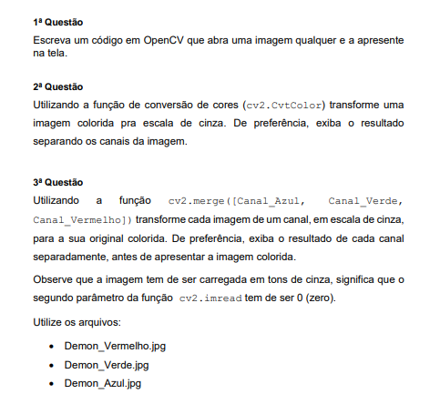

# 🖼️ Trabalho de Processamento digital de imagens 
Esse trabalho consiste de 3 questões formuladas pelo professor que tem por objetivo manipular imagens com o python. As questões estão na imagens a seguir 

## 🛠️ Dependencias do projeto
Todas as dependencias do projeto estão no arquivo `requirements.txt`.

## 🖥️ Utilização
Para cada questão será criado um arquivo python, basta executar o arquivo da questão desejada

> - [ ] Criar um tutorial de execução após finalizar o projeto

## 🧰 Tecnologias e ferramentas
 

 

